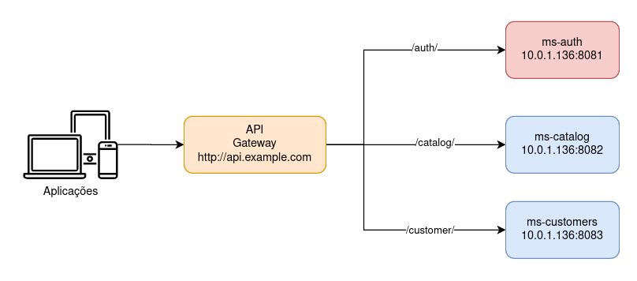

# API-Gateway
Este projeto é uma exemplo de implementação de um API Gateway usando NGINX.

A idéia é criar o "Single Entry Point" para um grupo de micro-serviços, padronizando a entrada de acesso e melhorando a segurança.

O projeto consiste em 3 micro-serviços de exemplo, que nada mais são do que arquivos PHP que retornam um JSON com seu nome e porta.



## Pré-requisitos

- Recomendado Linux
- Docker + Docker-Compose
- PHP nativo para simular os micro-serviços

## Preparando tudo

- Adicione a linha ```127.0.0.1 api.example.com``` ao seu arquivo ```/etc/hosts```
- Edite o arquivo ```docker/nginx/nginx.conf``` nas linhas 2, 6 e 10 adicionando o IP da sua máquina, Ex: 192.168.0.123

## Rodando

Disponibilizei 2 scripts para faciltar a execussão e a parada do projeto.

Utilize ```./start``` para iniciar e ```./stop``` para encerrar a execução.

## Testando

Para testar pode utilizar o Postman ou o próprio navegador.

Url: http://api.example.com

Rotas
---------------
[GET] /
```
{
  "status": "success",
  "result": "NGIX Api-Gatway working."
}
```


[GET] /auth/
```
{
  "status": "success",
  "message": "Auth service on port 8081"
}
```

[GET] /catalog/
```
{
  "status": "success",
  "message": "Catalog service on port 8082"
}
```

[GET] /customer/
```
{
  "status": "success",
  "message": "Customer service on port 8083"
}
```

## Conclusão

Este é apenas um exemplo para introduzir o conceito de API-Gateway, o NGINX oferece uma grande variedade de opções para configuração, validação, segurança, load balance e muito mais.

